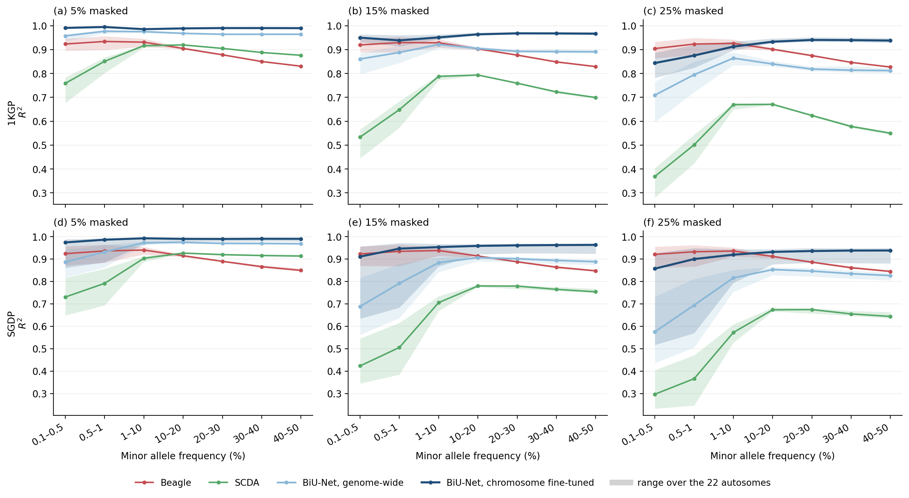
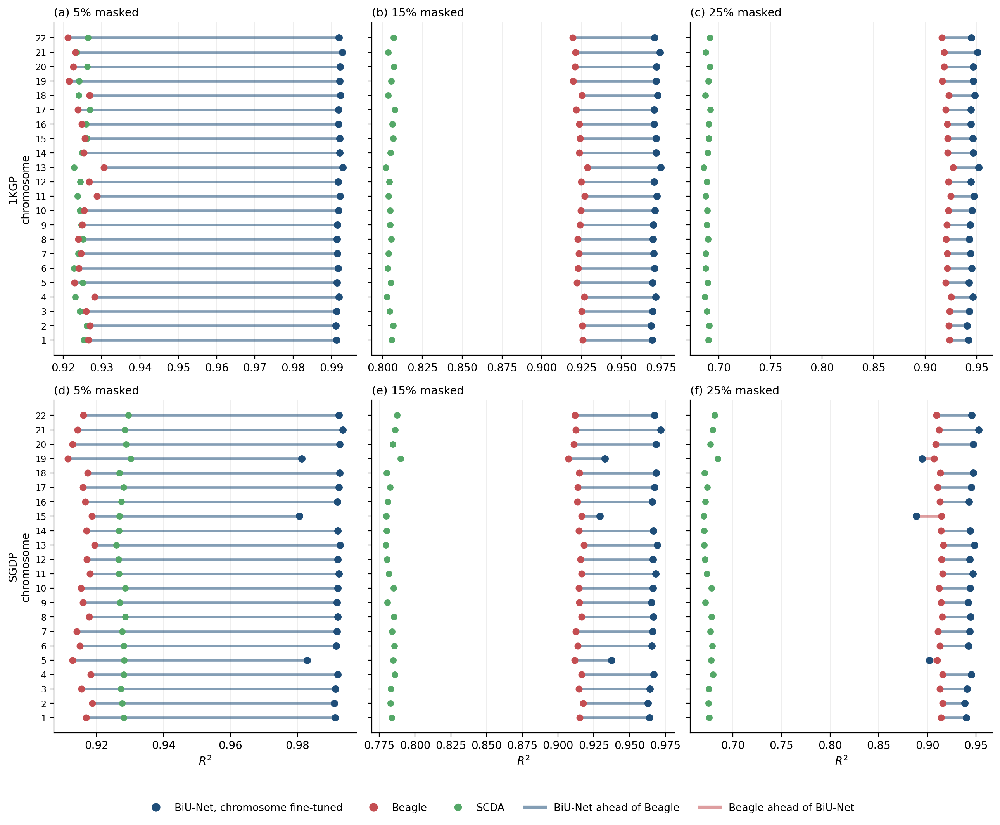
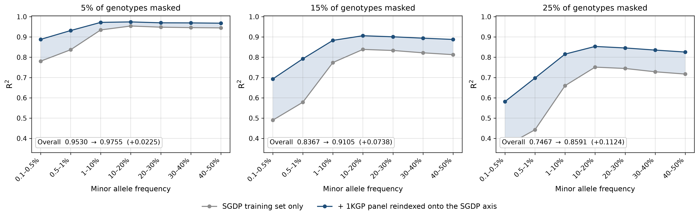
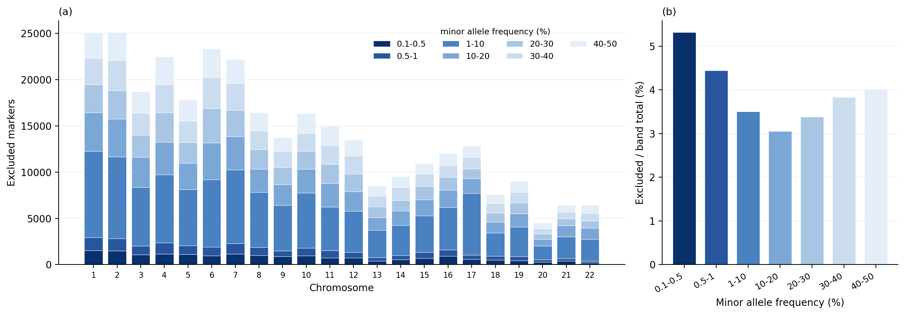

# Revision-2 artifacts

Every table and figure produced for the genome-wide revision, with the caption and footnotes it would carry in the manuscript, the analysis it supports, and a recommendation for placement. Nothing here is transcribed by hand: each item names the result file it is rendered from and the script that renders it, and every script reads the benchmark cells in `analysis/`.

The paths in the Source lines are relative to the project root on the cluster, `.`. `Results/` and `analysis/` hold data rather than code and are not in this repository; the scripts named beside them are.

## Common conventions

Genotypes are encoded in the four phased classes 0|0, 0|1, 1|0 and 1|1, and all accuracy figures are the R² between the true and the imputed codes, scored at every position (`benchmarkAll`) and pooled within a chromosome. Where a number spans chromosomes it is a mean weighted by the number of scored SNPs, except in Figure F1, whose line is a median and whose band is the full range, both stated in its caption. Each cell is the mean over three independent masking seeds (0, 42, 1024) at each of three masking rates (5%, 15%, 25%). The seven-bin minor-allele-frequency convention is [0.1, 0.5, 1, 10, 20, 30, 40, 50]%; the main tables collapse it to three groups and the per-chromosome supplementary tables retain all seven.

Three classes of model appear below, and the shorthand is used throughout. Everything else that qualifies a number, which marker set it was scored on and which checkpoint produced it, is stated in the caption of the table or figure that reports it.

- **SC-T** (single chromosome, target only). One model per chromosome, trained on the training split of the target cohort alone, with no reference panel in training. These are the models of the original submission; their values are read from its supplementary tables rather than recomputed.
- **GW-M** (genome wide, merged). One model per dataset, trained on all 22 autosomes at once, with the reference panel merged into the training data. This is the model class the revision introduces in response to the review, and it supplies most of the values below.
- **GW-M+FT** (genome wide, merged, then fine-tuned). A GW-M checkpoint fine-tuned on a single chromosome for 30 epochs, with nothing else changed. It has the per-chromosome scope of SC-T and the training data of GW-M. The pair differs in the reference, and also in segmentation and in reaching the chromosome through a genome-wide checkpoint, which Table T7 states where it uses them.

Reported checkpoints are pinned, not inferred: 1KGP GW-M at epoch 70 and 1KGP SCDA at epoch 286; the SGDP models at their validation-selected best; the fine-tuned family at epoch 30 on 1KGP, where validation is folded into training, and at the validation-selected best on SGDP, where it is held out.

---

## T1. Genome-wide accuracy on 1KGP

**Table T1. Imputation accuracy on the 1000 Genomes Project test set across all 22 autosomes.**

| Masking | Method | Rare (≤1%) | Low (1–10%) | Common (>10%) | Overall |
|---|---|---|---|---|---|
| 5% | BiU-Net, GW-M | 0.9636 | 0.9753 | 0.9658 | 0.9776 |
| 5% | **BiU-Net, GW-M+FT** | **0.9919** | **0.9857** | **0.9894** | **0.9917** |
| 5% | Beagle | 0.9290 | 0.9318 | 0.8748 | 0.9257 |
| 5% | SCDA | 0.7878 | 0.9163 | 0.9021 | 0.9246 |
| 15% | BiU-Net, GW-M | 0.8679 | 0.9214 | 0.8974 | 0.9293 |
| 15% | **BiU-Net, GW-M+FT** | **0.9442** | **0.9515** | **0.9657** | **0.9707** |
| 15% | Beagle | 0.9248 | 0.9297 | 0.8733 | 0.9243 |
| 15% | SCDA | 0.5712 | 0.7875 | 0.7549 | 0.8047 |
| 25% | BiU-Net, GW-M | 0.7408 | 0.8644 | 0.8256 | 0.8760 |
| 25% | **BiU-Net, GW-M+FT** | 0.8550 | 0.9131 | **0.9364** | **0.9447** |
| 25% | Beagle | **0.9136** | **0.9269** | 0.8713 | 0.9222 |
| 25% | SCDA | 0.4144 | 0.6687 | 0.6202 | 0.6886 |

Values are R², mean over three masking seeds. Standard deviations across seeds are at most 0.0002 and are omitted here; they are retained in the source file. BiU-Net GW-M and SCDA are single genome-wide models. Both train on the 2,285 samples that Beagle receives as its reference panel, which on 1KGP is the target cohort's own training and validation splits rather than an external panel. Beagle scores every one of the 17,365,621 target markers across the 22 autosomes of this dataset, so no marker exclusion applies (Table T6).

*Source: Results/rev2_1KGP_main_table_revision2.csv (job 989417). Code: scripts/build_rev2_main_tables.py*

**Analysis.** GW-M answers the reviewers' question, whether one model can serve the whole genome, and the table shows what that costs against Beagle: a lead at low masking that becomes a deficit at 25%, concentrated in rare variants. GW-M+FT is the same model specialised per chromosome, and it leads overall at every masking rate. At 25% masking Beagle keeps both the rare group and the 1 to 10% group, so the overall lead there rests on variants above 10% minor allele frequency.

**Placement.** Main text. This is the primary genome-wide result for the first dataset.

---

## T2. Genome-wide accuracy on SGDP

**Table T2. Imputation accuracy on the Simons Genome Diversity Project test set across all 22 autosomes.**

| Masking | Method | Rare (≤1%) | Low (1–10%) | Common (>10%) | Overall |
|---|---|---|---|---|---|
| 5% | BiU-Net, GW-M | 0.9108 | 0.9720 | 0.9709 | 0.9755 |
| 5% | **BiU-Net, GW-M+FT** | **0.9721** | **0.9900** | **0.9886** | **0.9908** |
| 5% | Beagle | 0.9291 | 0.9406 | 0.8853 | 0.9163 |
| 5% | SCDA | 0.7648 | 0.9031 | 0.9199 | 0.9277 |
| 15% | BiU-Net, GW-M | 0.7448 | 0.8833 | 0.8987 | 0.9105 |
| 15% | **BiU-Net, GW-M+FT** | 0.9083 | **0.9472** | **0.9569** | **0.9624** |
| 15% | Beagle | **0.9272** | 0.9385 | 0.8834 | 0.9147 |
| 15% | SCDA | 0.4719 | 0.7064 | 0.7715 | 0.7833 |
| 25% | BiU-Net, GW-M | 0.6419 | 0.8155 | 0.8422 | 0.8591 |
| 25% | **BiU-Net, GW-M+FT** | 0.8554 | 0.9111 | **0.9294** | **0.9378** |
| 25% | Beagle | **0.9256** | **0.9365** | 0.8816 | 0.9132 |
| 25% | SCDA | 0.3392 | 0.5739 | 0.6642 | 0.6757 |

Conventions as in Table T1, except that standard deviations across seeds reach 0.0004 here rather than 0.0002. BiU-Net and SCDA were trained from random initialisation on the SGDP training split (213 samples) merged with the full 1KGP panel (2,548 samples) projected onto the SGDP variant axis. The two datasets are reported as independent experiments; no weights are carried from the 1KGP models. Beagle imputes SGDP with the same full 1KGP panel and declines the target markers absent from it (Table T6). All three methods are scored on the markers Beagle retains, so the exclusion removes the same variants from every row of this table rather than crediting one method with them.

*Source: Results/rev2_SGDP_main_table_revision2.csv (job 989417). Code: scripts/build_rev2_main_tables.py*

**Analysis.** The same two models on a cohort an order of magnitude smaller. Every level drops, and the rare group changes hands: on 1KGP GW-M leads Beagle there at 5% masking, here it trails. Fine-tuning is worth more on this dataset than on 1KGP at every masking rate. Beagle keeps the rare group at 15% and 25%, and at 25% it keeps the 1 to 10% group as well. The shared marker set excludes the 3.60% of the target Beagle cannot call at all, which Table T6 reports separately.

**Placement.** Main text, beside Table T1.

---

## F1. The frequency profile



**Figure F1. Imputation accuracy across the allele-frequency spectrum.** Rows are datasets, columns are the fraction of genotypes masked. Each line is the median over the 22 autosomes of the R², pooled within a chromosome and averaged over three masking seeds; the band around it spans the full range over those chromosomes. The two BiU-Net series differ only in whether the genome-wide merged-data model was fine-tuned on one chromosome for 30 epochs, so the vertical distance between them is the effect of that fine-tuning.

Cells whose predictions carry values outside the genotype codes are excluded before averaging. A handful of such values changes the fraction of genotypes called correctly by almost nothing, since the matrix is overwhelmingly homozygous reference, but it sets the variance of the predictions and drives R² to zero. The rendering script names every cell it drops.

*Source: benchmark cells in analysis/. Code: scripts/build_rev2_maf_profile.py*

**Analysis.** The learned models and Beagle cross in the 1% to 10% band once masking passes 5%, and the crossing moves toward common variants as masking rises. Fine-tuning lifts every frequency group, most in the rare group, and most of all on SGDP.

**Placement.** Main text.

---

## F2. Chromosome by chromosome, against the baselines



**Figure F2. Per-chromosome accuracy of the delivered model against the two baselines.** Rows are datasets, columns are the fraction of genotypes masked, and each row within a panel is one autosome. Points are the R² pooled over all positions of that chromosome and averaged over three masking seeds. The connector joins Beagle to BiU-Net and takes its colour from which of the two is higher.

BiU-Net here is GW-M+FT, the merged-data genome-wide model after 30 epochs of fine-tuning on the chromosome being scored. GW-M is reported in Table T4.

*Source: benchmark cells in analysis/. Code: scripts/build_rev2_per_chromosome.py*

**Analysis.** A genome-wide average cannot separate a general advantage from one carried by the largest chromosomes. Reading chromosome by chromosome, BiU-Net is ahead of Beagle in 129 of the 132 combinations. All three exceptions are SGDP at 25% masking: chromosome 15 by 0.026, chromosome 19 by 0.012, and chromosome 5 by 0.008.

**Placement.** Main text, beside Figure F1, which resolves the same comparison by frequency instead of by chromosome.

---

## T3. Genome-wide merged model against the single-chromosome target-only models

**Table T3. GW-M, one merged-data model per dataset covering all 22 autosomes, against SC-T, the per-chromosome target-only models of the original submission, at the three chromosomes that submission covers. Overall R².**

| Anchor | Masking | SC-T | GW-M | GW-M − SC-T |
|---|---|---|---|---|
| 1KGP chr22 | 5% | 0.9957 | 0.9766 | −0.019 |
| 1KGP chr22 | 15% | 0.9844 | 0.9258 | −0.059 |
| 1KGP chr22 | 25% | 0.9694 | 0.8699 | −0.100 |
| SGDP chr22 | 5% | 0.9872 | 0.9736 | −0.014 |
| SGDP chr22 | 15% | 0.9557 | 0.9041 | −0.052 |
| SGDP chr22 | 25% | 0.9312 | 0.8494 | −0.082 |
| SGDP chr19 | 5% | 0.9680 | 0.9744 | **+0.006** |
| SGDP chr19 | 15% | 0.9120 | 0.9067 | −0.005 |
| SGDP chr19 | 25% | 0.8676 | 0.8534 | −0.014 |

SC-T values are parsed from the submitted supplementary tables (S1 to S3 for 1KGP chromosome 22, S7 to S9 for SGDP chromosome 22, S13 to S15 for SGDP chromosome 19), and the archived runs behind those tables reproduce their printed values exactly. The comparison spans two differences at once, scope and training data: SC-T sees one chromosome and no reference, GW-M sees 22 chromosomes and the merged reference. Table T4 separates the two by holding scope fixed.

Each row is scored on the marker set the corresponding SC-T table was itself scored on, and that set is not the same at the three anchors. On 1KGP chromosome 22 Beagle imputes every marker, so the question does not arise: 241,113 markers, the set the main tables also use. On SGDP chromosome 22 the SC-T table used the full target axis, 117,318 markers, so the GW-M row comes from a rescore there. On SGDP chromosome 19 the SC-T table used the 196,443 markers Beagle retains, not the 205,485 of the full axis, so the GW-M row is scored on 196,443. The two SGDP anchors differ because the chromosome 19 tables were produced separately, by `build_chr19_tables.py`, which prints both marker counts as header rows while reading each method's metrics from that method's own analysis cell, and the BiU-Net cell there was written with `overlappedOnly` set. The per-bin counts match the SC-T tables at every anchor once the correct set is used, and the source file carries the counts and a per-row check. The SC-T tables label their rarest bin ≤0.5%, whereas the bins used here begin at 0.1%; the marker counts behind the two are identical, so the rows are like-for-like.

*Source: Results/rev2_vs_manuscript_revision2.csv. Code: scripts/build_rev2_vs_manuscript.py*

**Analysis.** This is the price of the design the review asked for: one model instead of 22, evaluated against the models the submission reported. The shortfall grows with masking and is smaller on SGDP, where the reference adds far more to a small cohort than it does to 1KGP. Table T4 shows how much of it fine-tuning returns.

**Placement.** Main text, as the direct comparison against the models of the original submission; otherwise supplement, with one sentence in the Results.

---

## T4. Per-chromosome fine-tuning of the merged-data model

**Table T4. GW-M+FT, the merged-data genome-wide model fine-tuned on one chromosome for 30 epochs, against the GW-M checkpoint it starts from. Every autosome of both datasets; Overall R² weighted across chromosomes by scored markers.**

| Dataset | Masking | GW-M | GW-M+FT | Gain | Chromosomes |
|---|---|---|---|---|---|
| 1KGP | 5% | 0.9776 | **0.9917** | +0.014 | 22 |
| 1KGP | 15% | 0.9293 | **0.9707** | +0.041 | 22 |
| 1KGP | 25% | 0.8760 | **0.9447** | +0.069 | 22 |
| SGDP | 5% | 0.9755 | **0.9908** | +0.015 | 22 |
| SGDP | 15% | 0.9105 | **0.9624** | +0.052 | 22 |
| SGDP | 25% | 0.8591 | **0.9378** | +0.079 | 22 |

At the chromosomes the original submission covers, the same models can be set against SC-T. Only 1KGP chromosome 22 and SGDP chromosome 19 were fine-tuned, so SGDP chromosome 22 appears in Table T3 but not here:

| Dataset, chromosome | Masking | GW-M | GW-M+FT | SC-T | GW-M+FT − SC-T |
|---|---|---|---|---|---|
| 1KGP chr22 | 5% | 0.9766 | 0.9919 | 0.9957 | −0.004 |
| 1KGP chr22 | 15% | 0.9258 | 0.9712 | 0.9844 | −0.013 |
| 1KGP chr22 | 25% | 0.8699 | 0.9453 | 0.9694 | −0.024 |
| SGDP chr19 | 5% | 0.9744 | **0.9813** | 0.9680 | **+0.013** |
| SGDP chr19 | 15% | 0.9067 | **0.9323** | 0.9120 | **+0.020** |
| SGDP chr19 | 25% | 0.8534 | **0.8941** | 0.8676 | **+0.027** |

Fine-tuning starts from the GW-M checkpoint and trains on one chromosome for 30 epochs at a learning rate of 1e-4, without curriculum or warmup. For SGDP the chromosome's slice of the aligned reference panel remains in training, so the only change from GW-M is the restriction to one chromosome. GW-M+FT and SC-T share their scope; Table T7 sets them against each other and lists what else differs. Markers of minor allele frequency 0.1% to 0.5% gain most: with a quarter of genotypes masked, R² in that bin rises from 0.6378 to 0.8090 on 1KGP chromosome 22 and from 0.4353 to 0.5144 on SGDP chromosome 19. Both anchors are scored on the marker set the corresponding SC-T table used, which is the full 241,113 markers on 1KGP chromosome 22 and the 196,443 markers Beagle retains on SGDP chromosome 19; Table T3 states why the two differ. Table T7 breaks the SC-T comparison down by frequency bin.

*Source: Results/rev2_chrft_summary_revision2.csv and Results/rev2_chrft_per_chromosome_revision2.csv for the genome-wide rows; Results/rev2_specialisation_revision2.csv for the anchors. Code: scripts/build_rev2_chrft.py, scripts/build_rev2_probes.py*

**Analysis.** Architecture, training data and objective are identical between GW-M and GW-M+FT, so the gap between them is what a genome-wide model gives up by spreading one parameter set over 22 chromosomes. Thirty epochs from an existing checkpoint recover most of it, against a full schedule from initialisation. Genome-wide coverage and per-chromosome accuracy are therefore not alternatives to choose between: the second is reachable from the first at a small fraction of the training cost.

**Placement.** Supplement, with two sentences in the Discussion. It bounds the cost of genome-wide scope but is not itself a headline result.

---

## T5. What the merged reference contributes



**Figure T5. Accuracy of two genome-wide SGDP models, one trained on the SGDP training split alone and one trained on that split merged with the 1KGP panel reindexed onto the SGDP variant axis.** R² by minor allele frequency, pooled within a chromosome, averaged across chromosomes weighted by the number of scored markers, and averaged over three masking seeds. Both models are scored on the 8,502,275 markers Beagle retains, so the two lines of every bin cover the same variants. The shaded interval is the gain.

Overall R² rises from 0.9530 to 0.9755 at 5% masking, from 0.8367 to 0.9105 at 15% and from 0.7467 to 0.8591 at 25%. Every frequency bin gains and the rare end gains most: the 0.1% to 0.5% bin by 0.107, 0.203 and 0.221 as masking rises, against 0.020 to 0.109 for the bins above 10% minor allele frequency.

*Source: Results/rev2_merge_effect_revision2.csv. Code: scripts/build_rev2_merge_effect.py, Results/Figure_merge_effect.py*

**Analysis.** A cohort of 213 samples carries little information about its own rare variants, which is where the merged panel helps most and where the gain grows fastest with the masking rate. The projection is what makes the merge possible at all: the two cohorts share 70.8% to 75.6% of the SGDP axis, so a merge that required the two variant lists to agree would have nothing to add.

**Placement.** Main text.

---

## T6. Markers a reference-based imputer cannot call

### The condition

Beagle keeps a target marker only when the reference stream holds a record it considers the same marker (`vcf/RefTargSlidingWindow.readWindow`):

```java
if (nextRefRec != null && nextRefRec.marker().equals(targMarker)) {
    targRecs.add(nextTargRec);
    refRecs.add(nextRefRec);
}
```

and `vcf/Marker.equals` treats two markers as the same when all four of these agree: chromosome, position, the full allele list, and the INFO/END value. A target record that finds no such match is passed over; nothing is written for it and no warning is issued. The only trace is the "Study markers" count in the run log.

Applying that condition to the two VCFs reproduces Beagle's output exactly. On SGDP chromosome 19 the condition predicts 196,444 retained markers and Beagle emits 196,443. The single difference is a position where the target carries two records and the panel one, which a single-pass merge cannot pair twice; the analysis sets elsewhere in this catalogue use Beagle's emitted 196,443. No marker is retained that the condition rejects. The exclusion is therefore this condition and nothing else: no quality threshold during matching, no filter after imputation.

*Source: reproduced from ../beagle/src/src/vcf/. Code: scripts/beagle_excluded_markers.py*

### Why a copying model cannot do otherwise

Beagle represents a target haplotype as a mosaic of reference haplotypes: at every marker it decides which panel haplotype the target is currently copying from, and reads the allele off that haplotype. At a marker the panel does not carry, there is no allele to read. The model has nothing to copy, so it emits nothing. The quantity the model reads does not exist at those markers. Requiring the allele list to match as well, rather than the position alone, is the same constraint one level down: genotypes are stored as indices into the allele list, so two records at one position with different allele lists use the same index to mean different bases, and pairing them would silently change what the output means.

### What the excluded markers are

The condition is compound, but in practice one of its clauses does almost all the work. On SGDP chromosome 19, of 9,042 excluded markers, 9,030 (99.87%) are at positions the panel does not contain at all; the remaining 12 (0.13%) sit at positions the panel does contain but with a different allele annotation.

The first group is a property of the two cohorts. The panel carries no haplotype data at these positions, so no change of file format recovers them. Population divergence is one reason a position is missing from a panel; independent calling and filtering decisions are another, and this catalogue does not separate them. This is the reason reference-based imputation asks that the panel be drawn from a population close to the target, and it is why the exclusion rate is a useful measurement in its own right: 3.60% of markers on SGDP against none on 1KGP, whose target samples come from the panel cohort itself.

The second group is a representation difference rather than a biological one, arising from multi-allelic sites split differently, indels spelled differently, or strand conventions. Some of it can be removed by harmonising the two files before imputation, though not all: at A/T and C/G sites a strand flip cannot be told from a genuine allele difference by inspection. Here it is 12 of the 9,042 excluded markers on chromosome 19. Both datasets passed through one calling and filtering pipeline, so this figure says nothing about what two independently processed cohorts would show.

### Why the loss matters

**Table T6. Markers with no reference match, SGDP, all 22 autosomes.**

| MAF bin | Target markers | Excluded | Rate | Share of all excluded |
|---|---|---|---|---|
| 0.1–0.5% | 331,887 | 17,659 | 5.32% | 5.6% |
| 0.5–1% | 357,538 | 15,897 | 4.45% | 5.0% |
| 1–10% | 3,213,493 | 112,485 | 3.50% | 35.4% |
| 10–20% | 1,682,947 | 51,344 | 3.05% | 16.2% |
| 20–30% | 1,205,703 | 40,814 | 3.39% | 12.8% |
| 30–40% | 1,055,017 | 40,456 | 3.83% | 12.7% |
| 40–50% | 973,498 | 39,148 | 4.02% | 12.3% |
| **All** | **8,820,083** | **317,803** | **3.60%** | **100%** |

On 1KGP the same computation gives zero excluded markers out of 17,365,621.

*Source: Results/beagle_excluded_markers_SGDP_revision2.csv, Results/beagle_excluded_markers_1KGP_revision2.csv (job 989447). Code: scripts/beagle_excluded_markers.py*



**Figure F3. Target markers with no reference match, SGDP, 22 autosomes.** (a) count of excluded markers per chromosome, segmented by minor allele frequency. (b) excluded markers in a frequency band over all target markers in that band, pooled across the 22 autosomes.

*Source: Results/beagle_excluded_markers_SGDP_revision2.csv. Code: scripts/build_rev2_excluded_figure.py*

Of the 8,820,083 SGDP target markers, 317,803 have no reference match, which is the 3.60% in the bottom row. Within a band the excluded fraction runs from 51,344 / 1,682,947 = 3.05% at 10% to 20% up to 17,659 / 331,887 = 5.32% at 0.1% to 0.5%, and that is the quantity in the Rate column and in panel (b) of Figure F3. Taken instead as a share of the 317,803, the 1% to 10% band contributes 112,485 = 35.4%, the four bands above 10% contribute 171,762 = 54.0%, and the two below 1% contribute 33,556 = 10.6%; 284,247 = 89.4% lie above 1% minor allele frequency.

The markers removed are those the panel does not carry, so the loss is concentrated on variation specific to the target cohort rather than spread evenly over the target.

### What is recoverable there

**Table T6b. Accuracy of GW-M+FT on the markers Beagle cannot call, SGDP, all 22 autosomes.**

| Masking | 0.1–0.5% | 0.5–1% | 1–10% | 10–20% | 20–30% | 30–40% | 40–50% | Overall |
|---|---|---|---|---|---|---|---|---|
| 5% | 0.9226 | 0.9454 | 0.9820 | 0.9808 | 0.9807 | 0.9837 | 0.9830 | **0.9852** |
| 15% | 0.7779 | 0.8227 | 0.9134 | 0.9278 | 0.9338 | 0.9391 | 0.9386 | **0.9422** |
| 25% | 0.6788 | 0.7333 | 0.8578 | 0.8853 | 0.8934 | 0.9020 | 0.9009 | **0.9064** |

Scored on the markers absent from the list of loci Beagle retained, 317,806 over the 22 autosomes; pooled within chromosome and weighted across chromosomes; three masking seeds. Beagle produces no call at any of them, so there is no column for it.

Three counts of the retained set are in play and they do not close exactly. Table T6 reaches 317,803 excluded and 8,502,280 retained by reproducing the match condition from the two VCF files; the benchmark scores 8,502,275 markers; this table scores 317,806. The retained counts differ by five markers, all on chromosome 22, where the match condition gives 110,855 against the 110,850 scored, and the two routes to the excluded set differ by three. Summing the two sets this table and the benchmark actually use gives 8,820,081 against the 8,820,083 markers on the target axis, leaving two unaccounted. The discrepancy is 5 markers in 8.8 million and does not move any reported value, but the reconciliation is stated here rather than left implied.

*Source: Results/rev2_excluded_recovery_revision2.csv. Code: benchmark.py --excludedOnly*

**Analysis.** A copying model has no state to read at these markers and emits nothing; a learned model conditions on the target cohort's own linkage and reconstructs them. Accuracy on a shared marker set and coverage of the target are separate quantities, and a comparison restricted to the shared set reports the first while saying nothing about the second.

**Placement.** The condition and the explanation belong in the Methods or in a short subsection of the Discussion. Table T6 with Figure F3 and Table T6b belong together in the Results, since they are the argument for coverage as a reported quantity alongside accuracy.

---

## T7. SC-T against GW-M+FT: the effect of the reference at fixed scope

The original submission reports SC-T models at three anchors; two of them, 1KGP chromosome 22 and SGDP chromosome 19, have a fine-tuned counterpart here. Both SC-T models were trained on the target cohort alone. The GW-M+FT models cover the same single chromosome. They differ from SC-T in training data, which includes the reference panel, in segmentation, and in reaching that chromosome through a genome-wide checkpoint. Scope is held fixed, so the remaining differences are the reference, the segmentation, and the genome-wide checkpoint the fine-tuning starts from. Table T7 resolves the comparison by frequency bin.

**Table T7. SC-T, the single-chromosome model trained on the target cohort alone, against GW-M+FT, the merged-data genome-wide model fine-tuned on the same chromosome. Both cover one chromosome; they differ in whether the reference panel entered training. R², averaged over three masking seeds.**

| MAF bin | 1KGP chr22 5% | | | 1KGP chr22 15% | | | 1KGP chr22 25% | | |
|---|---|---|---|---|---|---|---|---|---|
| | SC-T | GW-M+FT | Δ | SC-T | GW-M+FT | Δ | SC-T | GW-M+FT | Δ |
| 0.1–0.5% | 0.9966 | 0.9919 | −0.005 | 0.9655 | 0.9445 | −0.021 | 0.8495 | 0.8090 | −0.041 |
| 0.5–1% | 0.9965 | 0.9940 | −0.003 | 0.9344 | 0.9142 | −0.020 | 0.8619 | 0.8244 | −0.038 |
| 1–10% | 0.9915 | 0.9833 | −0.008 | 0.9698 | 0.9426 | −0.027 | 0.9443 | 0.8970 | −0.047 |
| 10–20% | 0.9952 | 0.9906 | −0.005 | 0.9849 | 0.9694 | −0.016 | 0.9720 | 0.9433 | −0.029 |
| 20–30% | 0.9947 | 0.9905 | −0.004 | 0.9836 | 0.9691 | −0.015 | 0.9699 | 0.9426 | −0.027 |
| 30–40% | 0.9948 | 0.9910 | −0.004 | 0.9836 | 0.9700 | −0.014 | 0.9697 | 0.9439 | −0.026 |
| 40–50% | 0.9943 | 0.9897 | −0.005 | 0.9821 | 0.9663 | −0.016 | 0.9669 | 0.9374 | −0.030 |
| **Overall** | **0.9957** | **0.9919** | **−0.004** | **0.9844** | **0.9712** | **−0.013** | **0.9694** | **0.9453** | **−0.024** |

| MAF bin | SGDP chr19 5% | | | SGDP chr19 15% | | | SGDP chr19 25% | | |
|---|---|---|---|---|---|---|---|---|---|
| | SC-T | GW-M+FT | Δ | SC-T | GW-M+FT | Δ | SC-T | GW-M+FT | Δ |
| 0.1–0.5% | 0.7480 | 0.8596 | **+0.112** | 0.5159 | 0.6308 | **+0.115** | 0.3988 | 0.5144 | **+0.116** |
| 0.5–1% | 0.7947 | 0.8844 | **+0.090** | 0.5783 | 0.6803 | **+0.102** | 0.4588 | 0.5669 | **+0.108** |
| 1–10% | 0.9343 | 0.9651 | +0.031 | 0.8256 | 0.8662 | +0.041 | 0.7455 | 0.7929 | +0.047 |
| 10–20% | 0.9685 | 0.9803 | +0.012 | 0.9127 | 0.9289 | +0.016 | 0.8692 | 0.8896 | +0.020 |
| 20–30% | 0.9670 | 0.9801 | +0.013 | 0.9128 | 0.9332 | +0.020 | 0.8694 | 0.8961 | +0.027 |
| 30–40% | 0.9690 | 0.9801 | +0.011 | 0.9158 | 0.9310 | +0.015 | 0.8737 | 0.8924 | +0.019 |
| 40–50% | 0.9680 | 0.9803 | +0.012 | 0.9105 | 0.9310 | +0.021 | 0.8657 | 0.8919 | +0.026 |
| **Overall** | **0.9680** | **0.9813** | **+0.013** | **0.9120** | **0.9323** | **+0.020** | **0.8676** | **0.8941** | **+0.027** |

SC-T values are parsed from supplementary Tables S1 to S3 and S13 to S15 of the submission, and both anchors are scored on the marker set those tables were themselves scored on. For 1KGP chromosome 22 that is the full 241,113 markers, since Beagle imputes every marker there and the two analysis sets coincide with identical per-bin counts. For SGDP chromosome 19 it is the 196,443 markers Beagle retains: the printed table carries two header rows, `#SNPs` at 205,485 and `#SNPs, Beagle` at 196,443, and the BiU-Net row was computed on the second, which the archived analysis cells confirm by reproducing every printed value at per-bin counts of 6,837, 7,548, 68,923, 40,538, 26,936, 23,633 and 22,028. Scoring GW-M+FT on the full 205,485 instead would read 0.0006 to 0.0029 lower and would not be like-for-like. The reference is a different quantity at each anchor. On 1KGP it is the 250 validation samples of the same cohort, merged so that BiU-Net and Beagle both see the 2,285-sample panel, an increase of 12% over the 2,035 samples SC-T trained on. On SGDP it is 2,548 samples from another cohort projected onto the target variant axis, an increase of 1,200% over the 213 samples SC-T trained on. Segmentation also differs: the submission used segments of 128 markers overlapping by 16, against 1,024 and 128 here.

*Source: Results/rev2_specialisation_revision2.csv (rows with denominator "full target axis" for SGDP). Code: scripts/build_rev2_probes.py, scripts/manuscript_supp.py*

**Interpretation.** The reference moves the two anchors in opposite directions, and the magnitude of the shift scales with the size of the target cohort relative to the reference panel.

On SGDP chromosome 19 the reference raises overall R² by 0.013 to 0.027 above SC-T. The increase concentrates in the two rarest frequency bins, which gain 0.090 to 0.116 of R² against 0.011 to 0.027 for the bins above 10% minor allele frequency, and it grows as more genotypes are masked. Figure T5 measures the reference on its own at the same scale: a genome-wide model trained on the SGDP split alone against one trained on that split merged with the reindexed panel, both scored on the same 8,502,275 markers, where the merge gains 0.023, 0.074 and 0.112 of overall R². Table T7 compares models that differ in more than the reference, so Figure T5 rather than T7 is what supports attributing an effect to it.

On 1KGP chromosome 22 the same procedure yields 0.004 to 0.024 below SC-T. The reference supplies 250 further samples of the cohort SC-T already trained on, an increase of 12% against 1,200% at the SGDP anchor, and SC-T stands at 0.9957 at 5% masking, which bounds any attainable increase at 0.004. The residual difference tracks scope rather than the reference: GW-M trails SC-T by 0.019 to 0.100 (Table T3), and 30 epochs of chromosome-22 fine-tuning recover most of that interval, leaving the values in Table T7 (Table T4).

Across the two anchors the benefit of the aligned reference tracks how much the target cohort lacked: large where the reference multiplies the training cohort twelvefold, absent where it adds 12%.

**Placement.** Table T7 in the supplement, one panel per anchor. The interpretation belongs in the Results, condensed to four or five sentences, with the table references retained.

---

## Methodological findings for the Discussion

Three questions were settled by experiment rather than by argument during this revision. Each is supported by a controlled comparison tabulated above.

### Reference and target can be placed on one variant axis, and the projection is what makes the reference useful

The original submission treats imputation as transductive: reference and target cohorts are called and filtered independently, their variant sets overlap only partially, and no model trained on one was applied to the other. The projection used here keeps the target's variant axis fixed, takes the reference genotype at positions the two share, codes reference samples as missing at target-private positions, and discards reference-private positions.

Two overlap figures appear in this catalogue and they measure different files, so they have to be stated apart. What is merged into training is the 1KGP call set as it exists in this pipeline, which carries 1,351,002 markers on chromosome 1; it shares 70.8% to 75.6% of the SGDP axis across the autosomes, mean 73.8%, so roughly a quarter of each axis is handled by the two fallback rules rather than by direct correspondence. What Beagle reads is the panel VCF, which is far denser at 5,795,045 markers on chromosome 1; it matches 96.4% of the SGDP axis, leaving the 3.60% of Table T6 unmatched. The same 2,548 samples underlie both, on two variant axes of different density.

Figure T5 measures what the projected reference contributes. Merging it raises overall R² by 0.023, 0.074 and 0.112 as the masking rate rises, the two models being scored on the same marker set, and the gain reaches 0.26 in the rarest frequency bins. The projection is what makes the merge available: the two cohorts share 70.8% to 75.6% of the SGDP axis, so a merge that required their variant lists to agree would have nothing to add.

Cohorts that share only part of their variant axis can still be merged, provided the merge is a projection onto the target axis. The shared fraction bounds how much of the reference contributes by direct correspondence and belongs beside any such merge, together with the name of the file it was measured on.

### A single genome-wide model is viable, and its cost is a fixed, measurable amount of accuracy

One model per dataset covers all 22 autosomes. Its cost relative to per-chromosome models is 0.019 to 0.100 of R² on 1KGP (Table T3), and it grows with the masking rate rather than with chromosome size. On SGDP the two anchors disagree in sign at the lowest masking rate: at chromosome 22 the genome-wide model trails by 0.014 to 0.082, while at chromosome 19 it runs from 0.006 above the per-chromosome model at 5% masking to 0.014 below it at 25%.

Two conditions made the genome-wide model practical, and both are reusable. The first is the input pipeline. Genome-wide training was not infeasible in principle; at the read throughput available before the genotype tensor was held in a factorised in-memory form, an epoch took 2 hours 20 minutes on 22 GPUs, against 5 minutes 35 seconds on 18 GPUs afterwards, and the campaign would not have finished. The two timings come from different allocations, so the ratio is not a controlled measurement of the pipeline alone, but the change of scale is not in question. The second is the merged reference, which raises the training cohort; Figure T5 shows a genome-wide model trained without it, so the merge improves the result rather than enabling it.

### When a shared model falls short, per-chromosome fine-tuning recovers most of the gap cheaply

Thirty epochs of fine-tuning on a single chromosome, starting from the genome-wide checkpoint and changing nothing else, recover 76% to 80% of the difference from the per-chromosome models on 1KGP and move past them on SGDP at every masking rate (Table T4). Because architecture, training data and objective are held fixed between the two, the recovered fraction measures the cost of distributing one parameter set over 22 chromosomes rather than any limit of the architecture.

A chromosome-specific model is therefore reachable from a genome-wide one at a small fraction of the cost of training it from initialisation.

### Two measurement facts worth reporting in any comparison of this kind

Beagle silently discards target markers it cannot match against the reference panel, keeping a record only when chromosome, position, allele list and INFO/END all agree. How large that fraction is depends on how far the target sits from the panel, with calling and filtering differences contributing as well: 3.60% of 8.8 million markers on SGDP against none of 17.4 million on 1KGP, where the target is drawn from the panel cohort itself (Table T6). A comparison that scores one method on markers another was never given is not a comparison of methods.

Comparing against previously published numbers requires matching their analysis set, not only their metric, and which set a published table used cannot be assumed from its caption. Everything reported here scores all methods on the markers every method retains, with the markers Beagle cannot call reported separately in Table T6b rather than folded into the comparison. The published per-chromosome tables are not uniform in this respect: at SGDP chromosome 22 the model was scored on all 117,318 target markers, at SGDP chromosome 19 on the 196,443 that Beagle retains, and the two tables look alike. The chromosome 19 table prints both counts as header rows, so the distinction is recoverable, but only by checking which of the two the metric row was computed on. The two sets differ by 3.60% over the 22 autosomes and by 4.4% at chromosome 19, the excluded markers being the cohort-private ones, so mistaking one for the other moves overall R² by 0.001 to 0.005 and does so in the direction that flatters the newer result. Every anchor in Tables T3, T4 and T7 is therefore scored on the set its own published counterpart used, and each states which.

**Placement.** Discussion. The first three subsections each condense to a short paragraph; the fourth belongs in Methods or in a limitations paragraph, depending on how much space the Discussion has.

---

## Supplementary data files

| File | Contents |
|---|---|
| `Results/rev2_1KGP_per_chromosome_revision2.csv` | 1,584 rows: every chromosome, masking rate and MAF bin, all five metrics with across-seed standard deviations |
| `Results/rev2_SGDP_per_chromosome_revision2.csv` | as above, for SGDP |
| `Results/rev2_{1KGP,SGDP}_genomewide_summary_revision2.csv` | the seven-bin genome-wide tables the collapsed main tables are derived from |
| `Results/rev2_{1KGP,SGDP}_headtohead_revision2.csv` | BiU-Net minus Beagle per masking rate and bin |
| `Results/training_curve_*_revision2.csv` | per-epoch training and validation curves for every run, with the selected epoch marked |

**Placement.** Supplementary data, as machine-readable files rather than typeset tables.

---

## Items available but not proposed for inclusion

The learning curves (`training_curve_*`) are available as a figure. They do not support the two statements about them that have circulated in drafts. `training_curve_v3low_ref_g22_revision2.csv` covers epochs 25 to 132, marks its best at epoch 114, and shows validation accuracy still rising from 0.9717 at epoch 66 to 0.9729 at epoch 114, so it does not show the 1KGP model levelling off after epoch 70; the epoch 70 checkpoint is what was scored, on this dataset validation is folded into training and the curve is therefore not a held-out selection signal, and no other criterion for that choice is recorded. The claim that the SGDP model was still improving at epoch 140 of 160 has no matching curve file at all; the SGDP curves present cover the 100-epoch runs.

---

## Regenerating everything

```bash
# on the cluster, from the project root
sbatch job/rev2_tables.batch 1KGP        # per-chromosome, genome-wide, head-to-head
sbatch job/rev2_tables.batch SGDP
sbatch job/rev2_main_tables.batch 1KGP   # main table T1
sbatch job/rev2_main_tables.batch SGDP   # main table T2
sbatch job/rev2_figures.batch            # Figures F1 and F2
sbatch job/rev2_fullaxis_rescore.batch   # full-axis cells for the SC-T anchors
sbatch job/rev2_rebuild_tables.batch     # probes and the SC-T comparison
python scripts/build_rev2_merge_effect.py # Figure T5, from the benchmark cells
```

A copy of the submitted supplementary DOCX lives at `manuscript/` on the cluster so the SC-T columns can be filled there; `scripts/manuscript_supp.py` resolves it there or in the manuscript tree on a workstation, and the tables run either place. The rescore reads imputations that already exist under `impute/`, so no model is run and no GPU is needed; the six array tasks finish in about two minutes.
